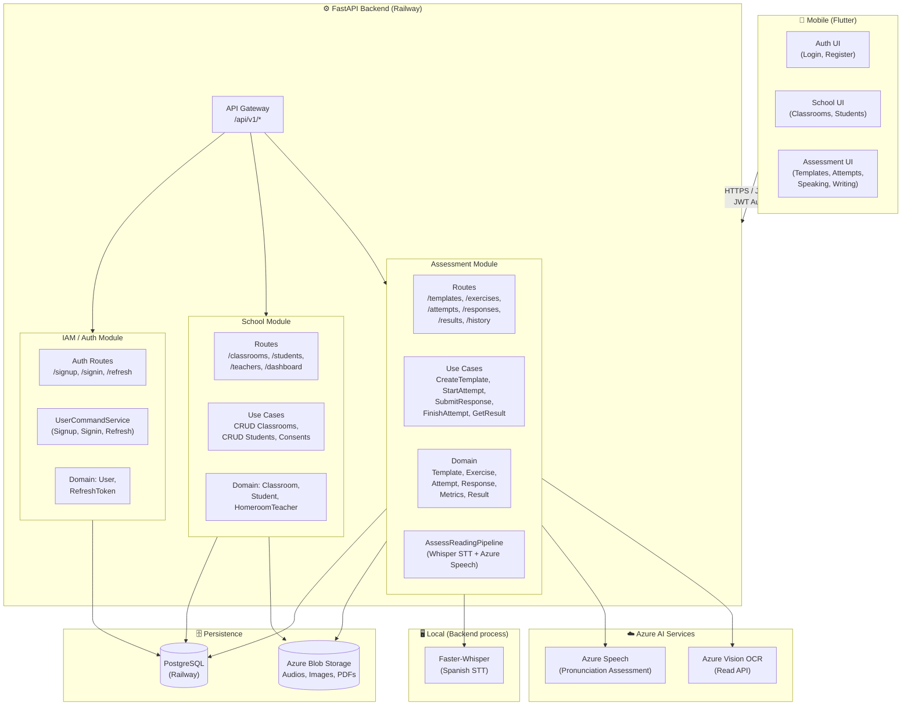
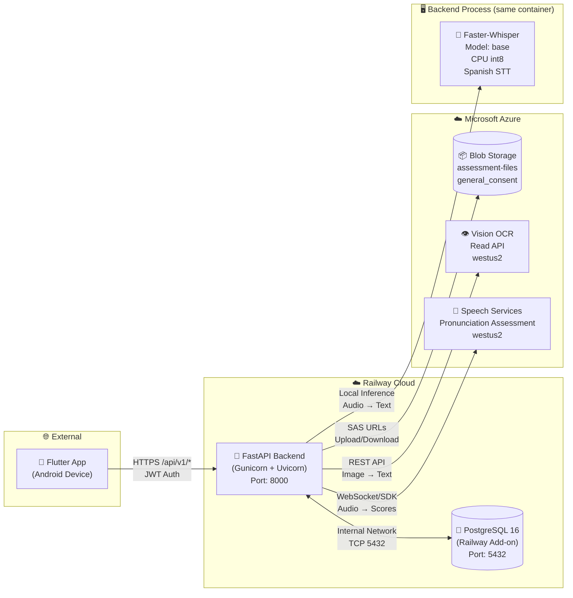
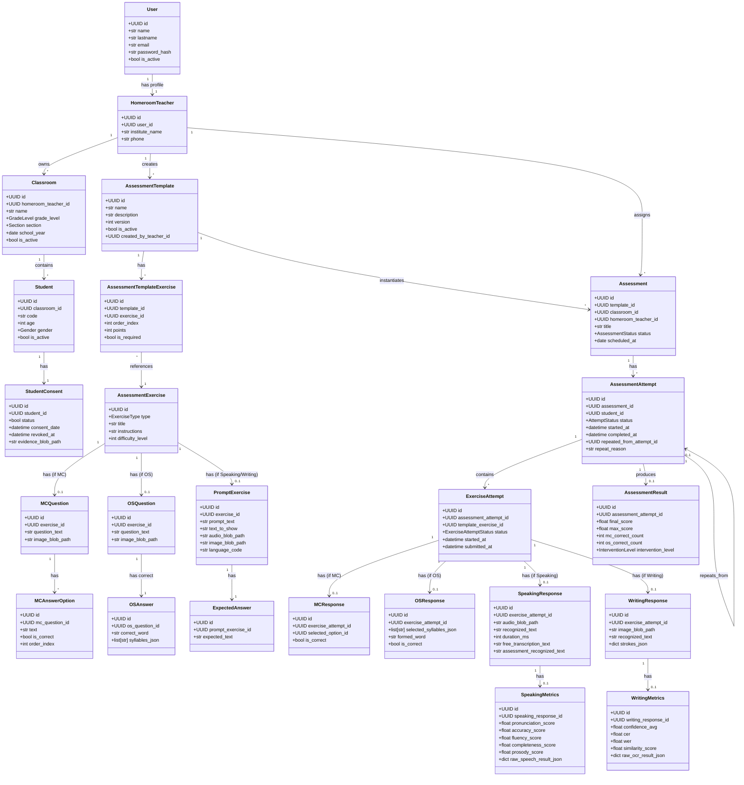
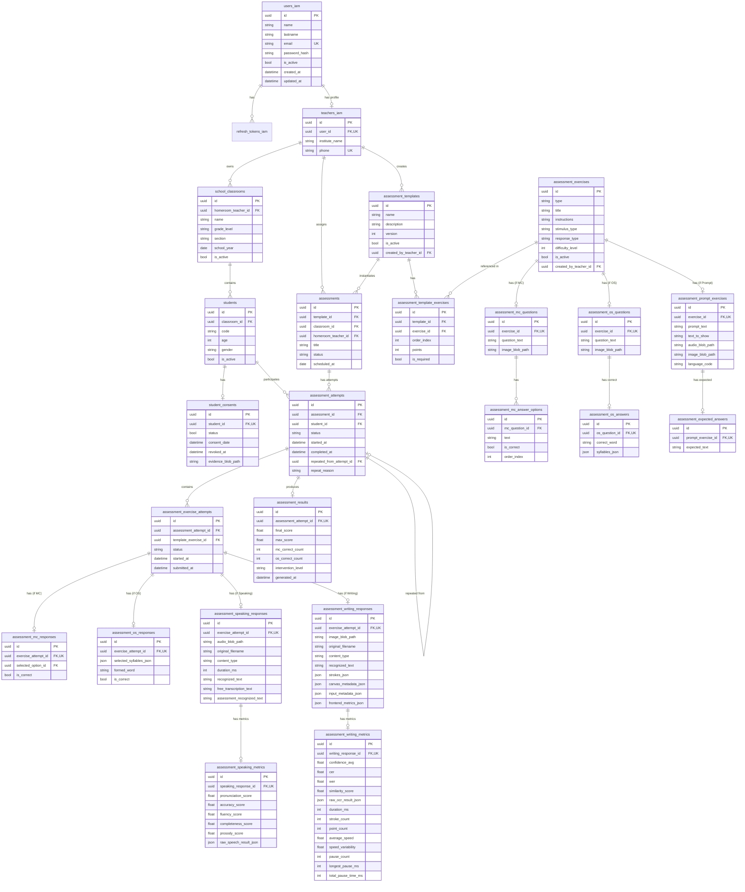
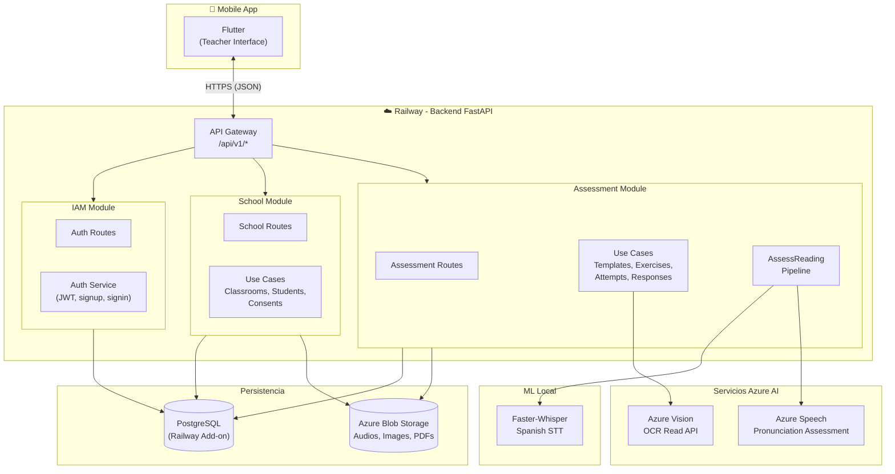
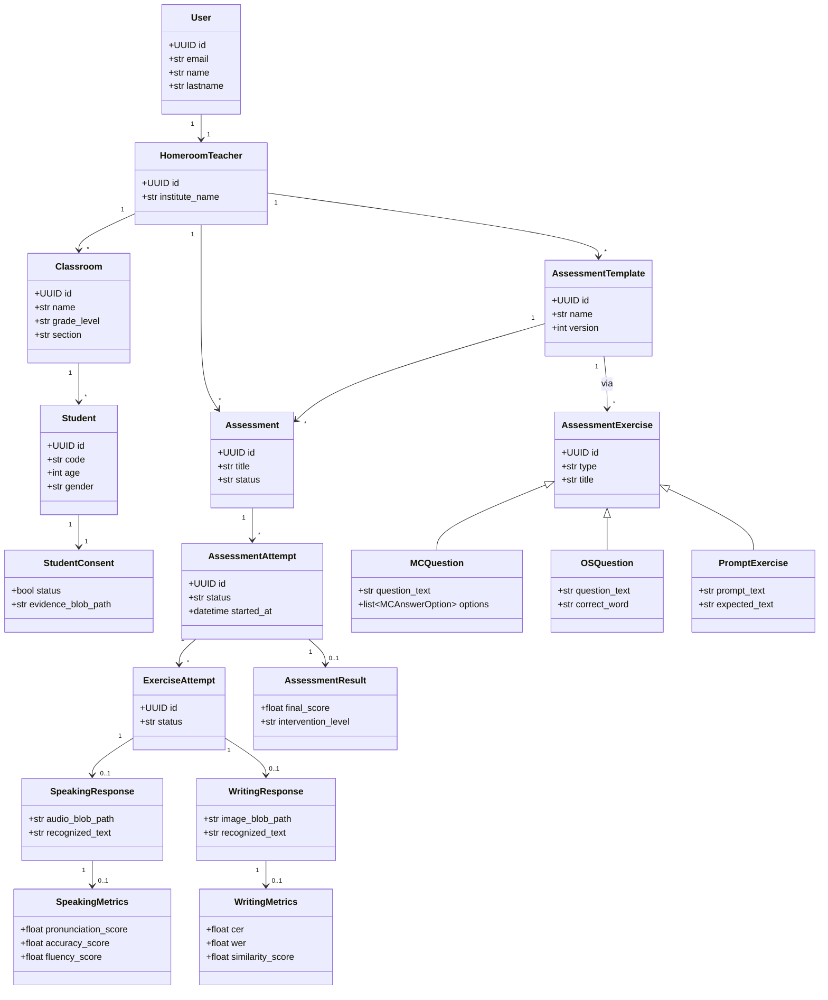
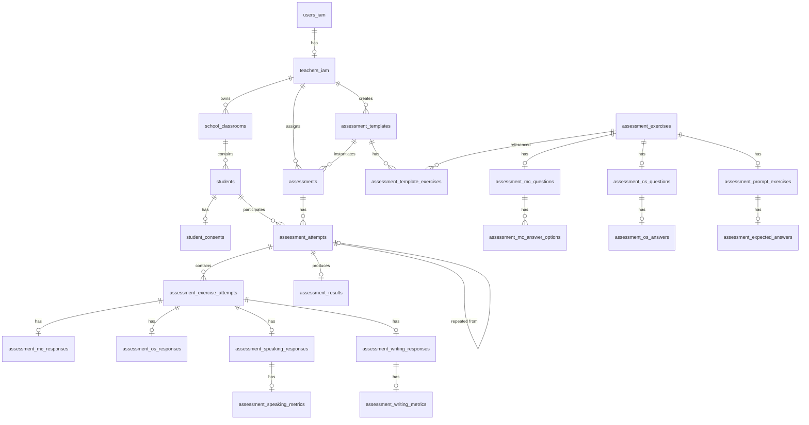
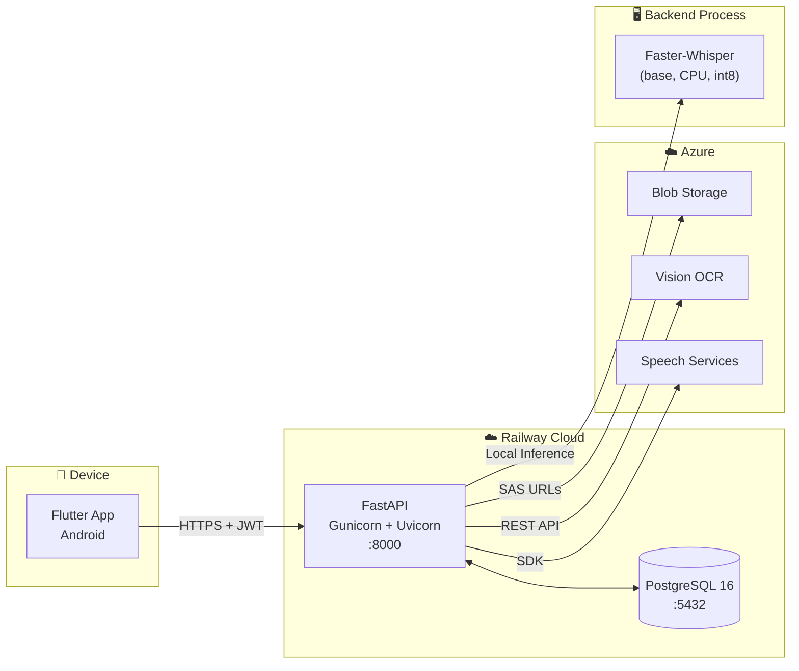

# Reporte Técnico de Arquitectura — TamizAI Backend

> **Propósito:** Documentar la arquitectura actual del backend para construir diagramas de exposición académica.
> **Fecha:** Julio 2026
> **Backend:** `backend/` — FastAPI + PostgreSQL + Clean Architecture + Azure AI Services

---

## 1. Resumen General del Backend

### Stack tecnológico

| Componente | Tecnología | Versión/Nota |
|---|---|---|
| Framework web | **FastAPI** | 0.138 |
| ORM | **SQLAlchemy** | 2.0 (con `Mapped`, `mapped_column`) |
| Migraciones | **Alembic** | 10 migrations |
| Base de datos | **PostgreSQL** (prod) / SQLite (dev) | psycopg driver |
| Autenticación | **JWT** (access + refresh tokens) | HS256, `passlib` pbkdf2_sha256 |
| Configuración | **Pydantic Settings** | `.env` |
| STT local | **Faster-Whisper** | Modelo `base` en CPU |
| Pronunciación | **Azure Speech SDK** | Pronunciation Assessment |
| OCR | **Azure AI Vision** | Read API |
| Storage | **Azure Blob Storage** | assessment-files, consents |
| PDF | **pypdf + reportlab** | Watermark, consent templates |
| Mobile | **Flutter** | Android, iOS, Web |
| Hosting | **Railway** | Backend + PostgreSQL |

### Arquitectura

**Clean Architecture / Hexagonal (DDD-light)** con 3 bounded contexts (módulos):

```
┌──────────────────────────────────────────────────┐
│                  Presentation                     │
│          (routes, schemas, mappers)               │
├──────────────────────────────────────────────────┤
│                  Application                      │
│   (use_cases, ports/interfaces, services, DTOs)   │
├──────────────────────────────────────────────────┤
│                    Domain                         │
│      (entities, value objects, enums, logic)      │
├──────────────────────────────────────────────────┤
│                Infrastructure                     │
│  (SQLAlchemy models, repositories, adapters)      │
└──────────────────────────────────────────────────┘
```

### Organización por carpetas

```
backend/app/
├── main.py                     # Entry point FastAPI
├── core/                       # Config, Security (JWT), Email
├── db/                         # Session + engine + model imports (Alembic)
├── shared/                     # Base ORM, UUIDPrimaryKeyMixin, TimestampMixin
├── dependencies/               # auth (get_current_user), services
├── models/                     # Legacy V1 models (users, teacher_profiles, audit_log)
│
├── iam/                        # Módulo Identity & Access Management
│   ├── presentation/           #   routes, schemas, mappers
│   ├── application/            #   ports, services, commands, contexts, results
│   ├── domain/                 #   User, RefreshToken, PasswordReset, enums
│   └── infrastructure/         #   models, repositories, mappers
│
├── school/                     # Módulo School Management
│   ├── presentation/           #   classroom_routes, student_routes, teacher_routes, dashboard
│   ├── application/            #   ports, use_cases, assemblers, results
│   ├── domain/                 #   Classroom, Student, HomeroomTeacher, enums
│   └── infrastructure/         #   models, repositories, adapters (blob, iam, pdf)
│
└── assessment/                 # Módulo Assessment (el más grande)
    ├── presentation/           #   routes, schemas
    ├── application/            #   ports, use_cases, assemblers, exceptions
    ├── domain/                 #   template, exercise, question, attempt, response, metrics...
    └── infrastructure/         #   models, repositories, adapters (Azure, Whisper, Blob)
```

### Capas técnicas por módulo

Cada módulo (`iam`, `school`, `assessment`) replica la misma estructura de 4 capas:

| Capa | Directorio | Responsabilidad |
|---|---|---|
| **Presentation** | `presentation/` | FastAPI routes, Pydantic schemas request/response, mappers |
| **Application** | `application/` | Use cases (commands/queries), port interfaces (Protocols), services, DTOs |
| **Domain** | `domain/` | Dataclass entities, value objects, business logic, enums |
| **Infrastructure** | `infrastructure/` | SQLAlchemy models, repo implementations, external adapters |

---

## 2. Arquitectura Lógica

### Componentes lógicos

```
┌──────────┐     HTTPS      ┌──────────────────────────────────────────────────┐
│  Flutter  │ ─────────────▶ │              FastAPI Backend                     │
│  Mobile   │ ◀───────────── │              (Railway)                           │
└──────────┘     JSON        │                                                  │
                              │  ┌──────────┐  ┌──────────┐  ┌──────────────┐   │
                              │  │  IAM /   │  │  School  │  │  Assessment   │   │
                              │  │   Auth   │  │ Module   │  │   Module      │   │
                              │  └────┬─────┘  └────┬─────┘  └──────┬───────┘   │
                              │       │              │               │           │
                              │       └──────────────┴───────────────┘           │
                              │                       │                          │
                              │              ┌────────┴────────┐                 │
                              │              │   PostgreSQL    │                 │
                              │              │   (Railway)     │                 │
                              │              └────────┬────────┘                 │
                              └──────────────────────────────────────────────────┘
                                          │
                          ┌───────────────┼───────────────────┐
                          │               │                   │
                    ┌─────▼─────┐   ┌─────▼─────┐       ┌────▼────┐
                    │ Azure Blob │   │  Azure    │       │  Azure  │
                    │   Storage  │   │  Vision   │       │  Speech │
                    │            │   │  OCR      │       │         │
                    └────────────┘   └───────────┘       └─────────┘
```

### Responsabilidades

| Componente | Responsabilidad |
|---|---|
| **Flutter Mobile** | Interfaz de usuario para docentes. Captura audio (speaking), imágenes + strokes (writing). Consume API REST. Almacena tokens JWT localmente. |
| **IAM/Auth** | Registro, login, refresh token, logout, forgot/reset password. Crea perfil docente automáticamente en signup. |
| **School** | CRUD de aulas, estudiantes, consentimientos informados. Perfil docente. Dashboard con métricas resumen. |
| **Assessment** | El núcleo del negocio. Gestión de templates, ejercicios (MC, OS, Speaking, Writing). Creación de evaluaciones. Intentos, respuestas, scoring. Pipeline de lectura (Whisper + Azure Speech). OCR de escritura (Azure Vision). Resultados e intervención. |
| **PostgreSQL** | Persistencia transaccional. Todas las tablas del dominio. |
| **Azure Blob Storage** | Almacenamiento de archivos: audios de speaking, imágenes de writing, PDFs de consentimiento, assets de ejercicios. |
| **Azure Vision OCR** | Extracción de texto manuscrito desde imágenes (ejercicios de escritura). |
| **Azure Speech** | Evaluación de pronunciación: accuracy, fluency, completeness, prosody scores. |
| **Faster-Whisper (local)** | Speech-to-text en español (fallback/local para transcripción). |

### Cómo se comunican

- **Flutter → API**: HTTPS/JSON. JWT en header `Authorization: Bearer <token>`.
- **IAM → School**: El `IamAdapter` en school usa el `UserModel` directamente para consultar datos de usuario desde el perfil docente.
- **Assessment → Azure Services**: A través de adapters en `infrastructure/adapters/`. Se inyectan por dependency inversion (ports en `application/ports/`).
- **Assessment → School**: Los repositorios de Student, Classroom se usan desde assessment para validar ownership y obtener datos.
- **Assessment → Whisper**: Adapter local `FasterWhisperSpeechToTextAdapter`. Corre en el mismo proceso (CPU, int8).
- **Assessment → Blob**: `AzureAssessmentBlobStorage` para assets, `AzureConsentBlobStorage` para consentimientos.

### Mermaid — Arquitectura Lógica



---

## 3. Arquitectura Física / Despliegue

### Diagrama de despliegue

| Servicio | Plataforma | Accesible desde |
|---|---|---|
| **FastAPI Backend** | Railway (contenedor) | Internet (HTTPS) |
| **PostgreSQL** | Railway (add-on) | Solo backend (internal network) |
| **Azure Blob Storage** | Azure | Internet (SAS tokens) |
| **Azure Vision OCR** | Azure | Internet (API Key) |
| **Azure Speech** | Azure | Internet (API Key + Region) |
| **Flutter App** | Dispositivo Android | Internet (HTTPS al backend) |

### Variables de entorno principales

| Variable | Propósito | Secreto |
|---|---|---|
| `DATABASE_URL` | Conexión PostgreSQL | Sí |
| `ACCESS_TOKEN_SECRET` | Firma JWT access | Sí |
| `REFRESH_TOKEN_SECRET` | Firma JWT refresh | Sí |
| `AZURE_BLOB_CONNECTION_STRING` | Blob Storage | Sí |
| `AZURE_STORAGE_CONTAINER_NAME` | Container name | No |
| `AZURE_STORAGE_ASSESSMENT_CONTAINER_NAME` | Assessment container | No |
| `AZURE_VISION_ENDPOINT` | Vision OCR endpoint | No |
| `AZURE_VISION_KEY` | Vision API key | Sí |
| `AZURE_SPEECH_KEY` | Speech API key | Sí |
| `AZURE_SPEECH_REGION` | Speech region | No |
| `WHISPER_MODEL_SIZE` | Modelo Whisper (base) | No |
| `WHISPER_DEVICE` | cpu/cuda | No |
| `ENVIRONMENT` | local/production | No |
| `CORS_ORIGINS` | Orígenes CORS | No |

### Mermaid — Arquitectura Física



---

## 4. Módulos y Clases Principales

### 4.1 IAM / Auth

| Categoría | Clase | Archivo |
|---|---|---|
| **Domain Entity** | `User` | `iam/domain/user.py` |
| **Domain Entity** | `RefreshToken` | `iam/domain/refresh_token.py` |
| **Domain Entity** | `PasswordResetToken` | `iam/domain/password_reset.py` |
| **Domain Enum** | `UserRole` (TEACHER, ADMIN) | `iam/domain/enums.py` |
| **SQLAlchemy Model** | `UserModel` (tabla `users_iam`) | `iam/infrastructure/models/user_model.py` |
| **SQLAlchemy Model** | `RefreshTokenModel` (tabla `refresh_tokens_iam`) | `iam/infrastructure/models/refresh_token_model.py` |
| **SQLAlchemy Model** | `PasswordResetTokenModel` | `iam/infrastructure/models/password_reset_token_model.py` |
| **Repository Port** | `UserRepository`, `RefreshTokenRepository`, `PasswordResetTokenRepository` | `iam/application/ports/repositories.py` |
| **Repository Impl** | `SQLAlchemyUserRepository`, `SQLAlchemyRefreshTokenRepository`, `SQLAlchemyPasswordResetTokenRepository` | `iam/infrastructure/repositories/` |
| **Application Service** | `UserCommandServiceImpl` (signup, signin, refresh, signout, forgot/reset password) | `iam/application/services/user_command_service.py` |
| **Commands** | `CreateUserCommand`, `CreateRefreshTokenCommand`, `CreatePasswordResetTokenCommand` | `iam/application/commands/` |
| **Contexts** | `SignupContext`, `SigninContext`, `RefreshContext`, `SignoutContext`, `ForgotPasswordContext`, `ResetPasswordContext` | `iam/application/context/` |
| **Results** | `SigninResult`, `SignupResult`, `SignoutResult`, `RefreshResult` | `iam/application/results/` |
| **Assembler** | `AuthAssembler` | `iam/application/assemblers/auth_assembler.py` |
| **Validator** | `UserValidator` | `iam/application/validators/user_validator.py` |
| **Exceptions** | `IAMException`, `AlreadyExistsException`, `InvalidCredentialsException`, `InactiveUserException`, `NotFoundException` | `iam/application/exceptions/iam_exceptions.py` |
| **Facade** | `UserFacade` | `iam/facade/user_facade.py` |
| **Pydantic Schemas** | `SignupRequest`, `SigninRequest`, `RefreshRequest`, `SignoutRequest`, `ForgotPasswordRequest`, `ResetPasswordRequest`, `SigninResponse`, etc. | `iam/presentation/schemas.py` |
| **Routes** | `POST /auth/signup`, `/auth/signin`, `/auth/refresh`, `/auth/signout`, `/auth/forgot-password`, `PATCH /auth/reset-password` | `iam/presentation/routes.py` |

**JWT Logic**: `create_access_token()` en `core/security.py`. HS256, subject = user UUID. `decode_access_token()` para verificar. `get_current_user()` en `dependencies/auth.py` como FastAPI dependency.

### 4.2 School (Classroom, Student, Teacher)

| Categoría | Clase | Archivo |
|---|---|---|
| **Domain Entity** | `Classroom` | `school/domain/classroom.py` |
| **Domain Entity** | `Student` | `school/domain/student.py` |
| **Domain Entity** | `StudentConsent` | `school/domain/student.py` |
| **Domain Entity** | `HomeroomTeacher` | `school/domain/homeroom_teacher.py` |
| **Domain Enums** | `GradeLevel`, `Section`, `Gender` | `school/domain/enums.py` |
| **SQLAlchemy Model** | `ClassroomModel` (tabla `school_classrooms`) | `school/infrastructure/models/classroom_model.py` |
| **SQLAlchemy Model** | `Student` (tabla `students`) | `school/infrastructure/models/student_model.py` |
| **SQLAlchemy Model** | `StudentConsent` (tabla `student_consents`) | `school/infrastructure/models/student_model.py` |
| **SQLAlchemy Model** | `HomeroomTeacherModel` (tabla `teachers_iam`) | `school/infrastructure/models/homeroom_teacher_model.py` |
| **Repository Ports** | `StudentRepository`, `ClassroomRepository`, `ConsentRepository`, `HomeroomTeacherRepository`, `BlobStoragePort`, `UserManagementPort` | `school/application/ports/` |
| **Repository Impl** | `SQLAlchemyStudentRepository`, `SQLAlchemyClassroomRepository`, `SQLAlchemyStudentConsentRepository`, `SQLAlchemyHomeroomTeacherRepository` | `school/infrastructure/repositories/` |
| **Use Cases** | `CreateStudent`, `GetStudent`, `UpdateStudent`, `DeleteStudent`, `ListStudents`; `CreateClassroom`, `GetClassroom`, `UpdateClassroom`, `DeleteClassroom`, `ListClassroomsByTeacher`; `CreateHomeroomTeacher`, `GetHomeroomTeacher`, `UpdateHomeroomTeacher`; `UploadConsent`, `DownloadConsent`, `RevokeConsent` | `school/application/use_cases/` |
| **Assemblers** | `StudentAssembler`, `ClassroomAssembler`, `HomeroomTeacherAssembler` | `school/application/assemblers/` |
| **Results** | `StudentResult`, `ClassroomResult`, `HomeroomTeacherResult` | `school/application/results/` |
| **Exceptions** | `StudentExceptions`, `ClassroomExceptions`, `SchoolException` | `school/application/exceptions/` |
| **Adapters** | `IamAdapter` (user management via IAM module), `AzureConsentBlobStorage` (blob), `PdfWatermarkAdapter` (PDF generation) | `school/infrastructure/adapters/` |
| **Pydantic Schemas** | `CreateStudentRequest`, `UpdateStudentRequest`, `StudentResponse`, `StudentWithClassroomResponse`, `StudentListResponse`, `StudentConsentResponse`, `CreateClassroomRequest`, `ClassroomResponse`, `HomeroomTeacherResponse`, `UpdateHomeroomTeacherRequest` | `school/presentation/schemas.py` |
| **Routes** | `/classrooms` CRUD, `/classrooms/{id}/students` CRUD, `/students/{id}` CRUD, `/students/{id}/consent/*`, `/teachers/me`, `/dashboard/summary` | `school/presentation/` |

### 4.3 Assessment

| Categoría | Clase | Archivo |
|---|---|---|
| **Domain Entities** | `AssessmentTemplate`, `AssessmentTemplateExercise` | `assessment/domain/template.py` |
|  | `AssessmentExercise` | `assessment/domain/exercise.py` |
|  | `MCQuestion`, `MCAnswerOption`, `OSQuestion`, `OSAnswer` | `assessment/domain/question.py` |
|  | `PromptExercise`, `ExpectedAnswer` | `assessment/domain/prompt.py` |
|  | `Assessment` | `assessment/domain/assessment.py` |
|  | `AssessmentAttempt`, `ExerciseAttempt` | `assessment/domain/attempt.py` |
|  | `MCResponse`, `OSResponse`, `SpeakingResponse`, `WritingResponse` | `assessment/domain/response.py` |
|  | `SpeakingMetrics`, `WritingMetrics`, `AssessmentResult` | `assessment/domain/metrics.py` |
|  | `AssessmentReview` (review logic) | `assessment/domain/assessment_review.py` |
| **Domain Enums** | `ExerciseType` (ORDER_SYLLABLES, MULTIPLE_CHOICE, READING_SPEAKING, LISTENING_SPEAKING, READING_WRITING, LISTENING_WRITING), `AssessmentStatus` (DRAFT, ACTIVE, CLOSED), `AttemptStatus` (IN_PROGRESS, COMPLETED, CANCELLED), `ExerciseAttemptStatus` (PENDING, ANSWERED, EVALUATED, FAILED), `InterventionLevel` (LOW, MEDIUM, HIGH) | `assessment/domain/enums.py` |
| **Domain Logic** | `compare_texts()`, `char_accuracy()`, `word_accuracy()`, `determine_manual_review()` | `assessment/domain/text_comparison.py`, `writing_text_comparison.py`, `assessment_review.py` |
| **SQLAlchemy Models** | `AssessmentTemplateModel` (`assessment_templates`), `AssessmentTemplateExerciseModel` (`assessment_template_exercises`) | `assessment/infrastructure/models/template_model.py` |
|  | `AssessmentExerciseModel` (`assessment_exercises`) | `exercise_model.py` |
|  | `MCQuestionModel` (`assessment_mc_questions`), `MCAnswerOptionModel` (`assessment_mc_answer_options`), `OSQuestionModel` (`assessment_os_questions`), `OSAnswerModel` (`assessment_os_answers`) | `question_model.py` |
|  | `PromptExerciseModel` (`assessment_prompt_exercises`), `ExpectedAnswerModel` (`assessment_expected_answers`) | `prompt_model.py` |
|  | `AssessmentModel` (`assessments`) | `assessment_model.py` |
|  | `AssessmentAttemptModel` (`assessment_attempts`), `ExerciseAttemptModel` (`assessment_exercise_attempts`) | `attempt_model.py` |
|  | `MCResponseModel` (`assessment_mc_responses`), `OSResponseModel` (`assessment_os_responses`), `SpeakingResponseModel` (`assessment_speaking_responses`), `WritingResponseModel` (`assessment_writing_responses`) | `response_model.py` |
|  | `SpeakingMetricsModel` (`assessment_speaking_metrics`), `WritingMetricsModel` (`assessment_writing_metrics`), `AssessmentResultModel` (`assessment_results`) | `metrics_model.py` |
| **Repository Ports** | `AssessmentTemplateRepository`, `AssessmentTemplateExerciseRepository`, `AssessmentExerciseRepository`, `MCQuestionRepository`, `MCAnswerOptionRepository`, `OSQuestionRepository`, `OSAnswerRepository`, `PromptExerciseRepository`, `ExpectedAnswerRepository`, `AssessmentRepository`, `AssessmentAttemptRepository`, `ExerciseAttemptRepository`, `MCResponseRepository`, `OSResponseRepository`, `SpeakingResponseRepository`, `WritingResponseRepository`, `SpeakingMetricsRepository`, `WritingMetricsRepository`, `AssessmentResultRepository` | `assessment/application/ports/repositories.py` |
| **External Ports** | `SpeechToTextPort`, `SpeechAssessmentPort`, `OcrServicePort`, `BlobStoragePort`, `AudioPreparationPort` | `assessment/application/ports/` |
| **Repository Impl** | `SQLAlchemy*Repository` (one per entity) | `assessment/infrastructure/repositories/assessment_repositories.py` |
| **Use Cases** | `CreateTemplate`, `CreateExercise`, `AttachExerciseToTemplate`, `CreateAssessment`, `StartAssessmentAttempt`, `FinishAssessmentAttempt`, `RepeatAssessmentAttempt`, `SubmitMCResponse`, `SubmitOSResponse`, `UploadSpeakingResponse`, `UploadWritingResponse`, `GetAssessmentResult`, `GetStudentAssessmentHistory`, `AssessReadingPipeline` | `assessment/application/use_cases/` |
| **Adapters** | `FasterWhisperSpeechToTextAdapter`, `AzureSpeechPronunciationAssessmentService`, `AzureVisionOcrAdapter`, `AzureAssessmentBlobStorage` | `assessment/infrastructure/adapters/` |
| **Audio Processing** | `AssessmentAudioProcessor`, `prepare_audio()`, `PreparedAudio` | `assessment/infrastructure/audio_processing.py` |
| **Pydantic Schemas** | `CreateTemplateRequest`, `TemplateResponse`, `CreateExerciseRequest`, `ExerciseResponse`, `AttachExerciseRequest`, `MCQuestionData`, `OSQuestionData`, `PromptExerciseData`, `CreateAssessmentRequest`, `AssessmentResponse`, `StartAttemptRequest`, `AttemptResponse`, `AttemptDetailResponse`, `SubmitMCResponseRequest`, `MCResponseResponse`, `SubmitOSResponseRequest`, `OSResponseResponse`, `SpeakingResponseResponse`, `WritingResponseResponse`, `AssessmentResultResponse`, `ReviewResultResponse`, `StudentAssessmentHistoryResponse`, `RepeatAttemptRequest`, `RepeatAttemptResponse` | `assessment/presentation/schemas.py` |
| **Routes** | `/assessments/templates`, `/assessments/exercises`, `/assessments`, `/assessments/{id}/attempts`, `/assessments/attempts/{id}/finish`, `/assessments/attempts/{id}/result`, `/assessments/attempts/{id}/review`, `/assessments/attempts/{id}/repeat`, `/assessments/exercise-attempts/{id}/mc-response`, `/assessments/exercise-attempts/{id}/os-response`, `/assessments/exercise-attempts/{id}/speaking-response`, `/assessments/exercise-attempts/{id}/writing-response`, `/assessments/students/{id}/history`, `/assessments/students/{id}/attempts`, `/assessments/dev/speech/*` | `assessment/presentation/routes.py` |

### 4.4 External Adapters

| Adaptador | Archivo | Puerto que implementa | Servicio externo |
|---|---|---|---|
| `AzureSpeechPronunciationAssessmentService` | `assessment/infrastructure/adapters/azure_speech.py` | `NormalizedPronunciationAssessmentPort` | Azure Speech SDK |
| `AzureVisionOcrAdapter` | `assessment/infrastructure/adapters/azure_vision_ocr.py` | `OcrServicePort` | Azure AI Vision (Read API) |
| `FasterWhisperSpeechToTextAdapter` | `assessment/infrastructure/adapters/faster_whisper_stt.py` | `SpeechToTextPort` | Faster-Whisper (local) |
| `AzureAssessmentBlobStorage` | `assessment/infrastructure/adapters/assessment_blob_storage.py` | `BlobStoragePort` | Azure Blob Storage |
| `AzureConsentBlobStorage` | `school/infrastructure/adapters/blob_storage.py` | `BlobStoragePort` (school) | Azure Blob Storage |

### Mermaid — Diagrama de Clases (principales)



---

## 5. Base de Datos

### Tablas actuales (V2 — Assessment Schema)

#### IAM Tables

| Tabla | PK | Columnas principales | FK |
|---|---|---|---|
| `users_iam` | `id` (UUID) | `name`, `lastname`, `email` (unique), `password_hash`, `is_active`, `created_at`, `updated_at` | — |
| `refresh_tokens_iam` | `id` (UUID) | `token_hash` (unique), `revoked_at` | `user_id` → `users_iam.id` (CASCADE) |
| `password_reset_tokens_iam` | `id` (UUID) | `token_hash` (unique), `expires_at`, `used_at` | `user_id` → `users_iam.id` (CASCADE) |

#### School Tables

| Tabla | PK | Columnas principales | FK |
|---|---|---|---|
| `teachers_iam` | `id` (UUID) | `institute_name`, `phone` (unique) | `user_id` → `users_iam.id` (CASCADE, unique) |
| `school_classrooms` | `id` (UUID) | `name`, `grade_level`, `section` (char(1)), `school_year` (date), `is_active` | `homeroom_teacher_id` → `teachers_iam.id` (CASCADE) |
| `students` | `id` (UUID) | `code`, `age`, `gender` (string), `is_active` | `classroom_id` → `school_classrooms.id` (CASCADE). Unique(`classroom_id`, `code`) |
| `student_consents` | `id` (UUID) | `status` (bool), `consent_date`, `revoked_at`, `evidence_blob_path` | `student_id` → `students.id` (CASCADE, unique) |

#### Assessment Tables

| Tabla | PK | Columnas principales | FK |
|---|---|---|---|
| `assessment_templates` | `id` (UUID) | `name`, `description`, `version`, `is_active` | `created_by_teacher_id` → `teachers_iam.id` (SET NULL) |
| `assessment_template_exercises` | `id` (UUID) | `order_index`, `points`, `is_required` | `template_id` → `assessment_templates.id` (CASCADE). `exercise_id` → `assessment_exercises.id` (CASCADE) |
| `assessment_exercises` | `id` (UUID) | `type` (string), `title`, `instructions`, `stimulus_type`, `response_type`, `difficulty_level`, `is_active` | `created_by_teacher_id` → `teachers_iam.id` (SET NULL) |
| `assessment_mc_questions` | `id` (UUID) | `question_text`, `image_blob_path` | `exercise_id` → `assessment_exercises.id` (CASCADE, unique) |
| `assessment_mc_answer_options` | `id` (UUID) | `text`, `is_correct`, `order_index` | `mc_question_id` → `assessment_mc_questions.id` (CASCADE) |
| `assessment_os_questions` | `id` (UUID) | `question_text`, `image_blob_path` | `exercise_id` → `assessment_exercises.id` (CASCADE, unique) |
| `assessment_os_answers` | `id` (UUID) | `correct_word`, `syllables_json` (JSON) | `os_question_id` → `assessment_os_questions.id` (CASCADE, unique) |
| `assessment_prompt_exercises` | `id` (UUID) | `prompt_text`, `text_to_show`, `audio_blob_path`, `image_blob_path`, `language_code` | `exercise_id` → `assessment_exercises.id` (CASCADE, unique) |
| `assessment_expected_answers` | `id` (UUID) | `expected_text` | `prompt_exercise_id` → `assessment_prompt_exercises.id` (CASCADE, unique) |
| `assessments` | `id` (UUID) | `title`, `status` (string), `scheduled_at` (date) | `template_id` → `assessment_templates.id`. `classroom_id` → `school_classrooms.id`. `homeroom_teacher_id` → `teachers_iam.id` |
| `assessment_attempts` | `id` (UUID) | `status` (string), `started_at`, `completed_at`, `repeated_from_attempt_id`, `repeat_reason` | `assessment_id` → `assessments.id`. `student_id` → `students.id`. `repeated_from_attempt_id` → `assessment_attempts.id` (SET NULL) |
| `assessment_exercise_attempts` | `id` (UUID) | `status` (string), `started_at`, `submitted_at` | `assessment_attempt_id` → `assessment_attempts.id`. `template_exercise_id` → `assessment_template_exercises.id` |
| `assessment_mc_responses` | `id` (UUID) | `is_correct` | `exercise_attempt_id` → `assessment_exercise_attempts.id` (unique). `selected_option_id` → `assessment_mc_answer_options.id` |
| `assessment_os_responses` | `id` (UUID) | `selected_syllables_json` (JSON), `formed_word`, `is_correct` | `exercise_attempt_id` → `assessment_exercise_attempts.id` (unique) |
| `assessment_speaking_responses` | `id` (UUID) | `audio_blob_path`, `original_filename`, `content_type`, `duration_ms`, `recognized_text`, `free_transcription_text`, `assessment_recognized_text` | `exercise_attempt_id` → `assessment_exercise_attempts.id` (unique) |
| `assessment_writing_responses` | `id` (UUID) | `image_blob_path`, `original_filename`, `content_type`, `recognized_text`, `strokes_json` (JSON), `canvas_metadata_json`, `input_metadata_json`, `frontend_metrics_json` | `exercise_attempt_id` → `assessment_exercise_attempts.id` (unique) |
| `assessment_speaking_metrics` | `id` (UUID) | `pronunciation_score`, `accuracy_score`, `fluency_score`, `completeness_score`, `prosody_score`, `raw_speech_result_json` (JSON), `raw_transcription_result_json` (JSON) | `speaking_response_id` → `assessment_speaking_responses.id` (unique) |
| `assessment_writing_metrics` | `id` (UUID) | `confidence_avg`, `cer`, `wer`, `similarity_score`, `raw_ocr_result_json` (JSON), `duration_ms`, `stroke_count`, `point_count`, `average_speed`, `speed_variability`, `pause_count`, `longest_pause_ms`, `total_pause_time_ms`, `pressure_min`, `pressure_max`, `pressure_avg`, `bounding_box_json`, `writing_area_usage` | `writing_response_id` → `assessment_writing_responses.id` (unique) |
| `assessment_results` | `id` (UUID) | `final_score`, `max_score`, `mc_correct_count`, `os_correct_count`, `speaking_completed_count`, `writing_completed_count`, `speaking_average_score`, `speaking_review_required_count`, `writing_average_score`, `writing_review_required_count`, `total_exercises`, `evaluated_exercises`, `pending_exercises`, `intervention_level` (string), `generated_at` | `assessment_attempt_id` → `assessment_attempts.id` (unique) |

### Tablas Legacy (V1)

| Tabla | Nota |
|---|---|
| `users` | Reemplazada por `users_iam`. Sigue existiendo en `app/models/user.py` |
| `teacher_profiles` | Reemplazada por `teachers_iam`. Sigue existiendo |
| `audit_logs` | Existe pero sin uso activo en endpoints |
| `classrooms` | Reemplazada por `school_classrooms` (existió en V1) |
| `exercises` | Reemplazada por `assessment_exercises` |
| `assessment_sessions` | Reemplazada por `assessment_attempts` |
| `writing_samples` | Reemplazada por `assessment_writing_responses` |
| `audio_samples` | Reemplazada por `assessment_speaking_responses` |
| `ocr_analyses` | Reemplazada por `assessment_writing_metrics` |
| `pronunciation_analyses` | Reemplazada por `assessment_speaking_metrics` |
| `session_results` | Reemplazada por `assessment_results` |

### Cardinalidades resumidas

```
users_iam 1──1 teachers_iam 1──* school_classrooms 1──* students 1──1 student_consents
                      │                                       │
                      │                                       └──* assessment_attempts 1──* assessment_exercise_attempts
                      │                                           │                           │
                      ├──* assessment_templates                   │                           ├──0..1 assessment_mc_responses
                      │   └──* assessment_template_exercises      │                           ├──0..1 assessment_os_responses
                      │       └──1 assessment_exercises           │                           ├──0..1 assessment_speaking_responses
                      │           ├──0..1 assessment_mc_questions─* assessment_mc_answer_options│   └──0..1 assessment_speaking_metrics
                      │           ├──0..1 assessment_os_questions─1 assessment_os_answers      │                           │
                      │           └──0..1 assessment_prompt_exercises─1 assessment_expected_answers                       ├──0..1 assessment_writing_responses
                      └──* assessments (classroom_id)                                                 └──0..1 assessment_writing_metrics
                              └──* assessment_attempts 1──0..1 assessment_results
                                  (repeated_from_attempt_id ── self-ref)
```

### Mermaid — ER Diagram



---

## 6. Endpoints Principales

### Auth (`/api/v1/auth/*`)

| Método | Ruta | Propósito |
|---|---|---|
| `POST` | `/auth/signup` | Registrar usuario + crear perfil docente |
| `POST` | `/auth/signin` | Login → access + refresh tokens |
| `POST` | `/auth/refresh` | Rotar refresh token → nuevos tokens |
| `POST` | `/auth/signout` | Revocar refresh token |
| `POST` | `/auth/forgot-password` | Enviar token de reset por email |
| `PATCH` | `/auth/reset-password` | Resetear password con token |

### Teacher (`/api/v1/teachers/*`)

| Método | Ruta | Propósito |
|---|---|---|
| `GET` | `/teachers/me` | Obtener perfil del docente autenticado |
| `PUT` | `/teachers/me` | Actualizar perfil docente |

### Classrooms (`/api/v1/classrooms/*`)

| Método | Ruta | Propósito |
|---|---|---|
| `POST` | `/classrooms` | Crear aula |
| `GET` | `/classrooms` | Listar aulas del docente |
| `GET` | `/classrooms/{id}` | Obtener aula por ID |
| `PUT` | `/classrooms/{id}` | Actualizar aula |
| `DELETE` | `/classrooms/{id}` | Eliminar aula |

### Students (`/api/v1/students/*`)

| Método | Ruta | Propósito |
|---|---|---|
| `POST` | `/classrooms/{id}/students` | Crear estudiante en aula |
| `GET` | `/classrooms/{id}/students` | Listar estudiantes del aula |
| `GET` | `/students/{id}` | Obtener estudiante |
| `PUT` | `/students/{id}` | Actualizar estudiante |
| `DELETE` | `/students/{id}` | Eliminar estudiante |
| `GET` | `/students` | Listar todos (con filtros: classroom_id, q, is_active) |
| `POST` | `/students/{id}/consent/upload` | Subir PDF de consentimiento |
| `POST` | `/students/{id}/consent/revoke` | Revocar consentimiento |
| `GET` | `/students/{id}/consent` | Obtener estado del consentimiento |
| `GET` | `/students/{id}/consent/download` | Descargar PDF de consentimiento |
| `GET` | `/students/consent/template` | Obtener URL de plantilla de consentimiento |

### Dashboard (`/api/v1/dashboard/*`)

| Método | Ruta | Propósito |
|---|---|---|
| `GET` | `/dashboard/summary` | Resumen: total estudiantes, aulas, templates, assessments, attempts |

### Assessment Templates (`/api/v1/assessments/templates`)

| Método | Ruta | Propósito |
|---|---|---|
| `POST` | `/assessments/templates` | Crear template |
| `GET` | `/assessments/templates` | Listar templates del docente |
| `GET` | `/assessments/templates/{id}` | Obtener template |
| `POST` | `/assessments/templates/{id}/exercises` | Asociar ejercicio a template |

### Assessment Exercises (`/api/v1/assessments/exercises`)

| Método | Ruta | Propósito |
|---|---|---|
| `POST` | `/assessments/exercises` | Crear ejercicio (MC, OS, Prompt) |
| `GET` | `/assessments/exercises` | Listar ejercicios (con filtros) |
| `GET` | `/assessments/exercises/{id}` | Obtener detalle de ejercicio |
| `POST` | `/assessments/exercises/{id}/mc-question/image` | Subir imagen a MC question |

### Assessments (`/api/v1/assessments`)

| Método | Ruta | Propósito |
|---|---|---|
| `POST` | `/assessments` | Crear evaluación (template + classroom) |
| `GET` | `/assessments` | Listar evaluaciones del docente |
| `GET` | `/assessments/{id}` | Obtener evaluación |
| `GET` | `/assessments/{id}/attempts` | Listar intentos de una evaluación |

### Attempts (`/api/v1/assessments/attempts`)

| Método | Ruta | Propósito |
|---|---|---|
| `POST` | `/assessments/{id}/attempts` | Iniciar intento (start attempt) |
| `GET` | `/assessments/attempts/{id}` | Obtener detalle de intento + exercises |
| `POST` | `/assessments/attempts/{id}/finish` | Finalizar intento → generar resultado |
| `GET` | `/assessments/attempts/{id}/result` | Obtener resultado |
| `GET` | `/assessments/attempts/{id}/review` | Obtener review completo (student, ejercicio x ejercicio) |
| `POST` | `/assessments/attempts/{id}/repeat` | Repetir intento |

### Responses (`/api/v1/assessments/exercise-attempts`)

| Método | Ruta | Propósito |
|---|---|---|
| `POST` | `/exercise-attempts/{id}/mc-response` | Enviar respuesta MC |
| `GET` | `/exercise-attempts/{id}/mc-response` | Obtener respuesta MC |
| `POST` | `/exercise-attempts/{id}/os-response` | Enviar respuesta OS (ordenar sílabas) |
| `GET` | `/exercise-attempts/{id}/os-response` | Obtener respuesta OS |
| `POST` | `/exercise-attempts/{id}/speaking-response` | Subir audio + pipeline (Whisper + Azure Speech) |
| `GET` | `/exercise-attempts/{id}/speaking-response` | Obtener respuesta speaking + métricas |
| `POST` | `/exercise-attempts/{id}/writing-response` | Subir imagen + strokes → OCR Azure Vision |
| `GET` | `/exercise-attempts/{id}/writing-response` | Obtener respuesta writing + métricas |
| `GET` | `/responses/{id}/download-url` | Obtener URL de descarga de archivo |

### History (`/api/v1/assessments/students`)

| Método | Ruta | Propósito |
|---|---|---|
| `GET` | `/assessments/students/{id}/history` | Historial de evaluaciones del estudiante (con chart data) |
| `GET` | `/assessments/students/{id}/attempts` | Listar intentos del estudiante |

### Dev-only

| Método | Ruta | Propósito |
|---|---|---|
| `POST` | `/assessments/dev/speech/pronunciation-assessment` | Probar pipeline de lectura (no prod) |
| `POST` | `/assessments/dev/speech/compare-languages` | Comparar pronunciación en distintos locales |

---

## 7. Flujos Principales

### 7.1 Flujo de Autenticación

```
Flutter                         Backend                          PostgreSQL
  │                                │                                │
  │  POST /auth/signin              │                                │
  │  {email, password}              │                                │
  │ ──────────────────────────────▶ │                                │
  │                                │  verify_password()              │
  │                                │ ───────────────────────────────▶│
  │                                │ ◀───────────────────────────────│
  │                                │                                │
  │                                │  create_access_token() (HS256)  │
  │                                │  generate_refresh_token()       │
  │                                │  hash + store refresh token    │
  │                                │ ───────────────────────────────▶│
  │                                │ ◀───────────────────────────────│
  │  {access_token, refresh_token} │                                │
  │ ◀──────────────────────────────│                                │
  │                                │                                │
  │  [Almacena tokens seguros]     │                                │
  │                                │                                │
  │  GET /classrooms               │                                │
  │  Authorization: Bearer <AT>    │                                │
  │ ──────────────────────────────▶│                                │
  │                                │  decode_access_token()          │
  │                                │  get_current_user() → UserModel│
  │                                │ ───────────────────────────────▶│
  │                                │ ◀───────────────────────────────│
  │ ◀──────────────────────────────│                                │
```

### 7.2 Flujo de Gestión Escolar

```
Teacher (Flutter)          Backend                PostgreSQL
      │                       │                       │
      │ POST /auth/signup     │                       │
      │ {name, lastname,      │                       │
      │  email, password,     │                       │
      │  institute, phone}    │                       │
      │ ─────────────────────▶│                       │
      │                       │── create User ───────▶│
      │                       │── create HomeroomTeacher ▶
      │                       │(user_id, institute,   │
      │                       │ phone)                │
      │ ◀─────────────────────│                       │
      │                       │                       │
      │ POST /classrooms      │                       │
      │ {name, grade,         │                       │
      │  section, school_year}│                       │
      │ ─────────────────────▶│                       │
      │                       │── resolve teacher ───▶│
      │                       │── insert classroom ──▶│
      │ ◀─────────────────────│                       │
      │                       │                       │
      │ POST /classrooms/{id}/students                │
      │ {code, age, gender}   │                       │
      │ ─────────────────────▶│                       │
      │                       │── insert student ────▶│
      │ ◀─────────────────────│                       │
      │                       │                       │
      │ POST /students/{id}/consent/upload            │
      │ [PDF file]            │                       │
      │ ─────────────────────▶│                       │
      │                       │── upload to Blob ────▶│ Azure Blob
      │                       │── update consent ────▶│
      │ ◀─────────────────────│                       │
```

### 7.3 Flujo de Assessment

```
Teacher                   Backend                              DB
  │                         │                                   │
  │ POST /templates         │                                   │
  │ ───────────────────────▶│── insert template ───────────────▶│
  │ ◀───────────────────────│                                   │
  │                         │                                   │
  │ POST /exercises         │                                   │
  │ {type, title,           │                                   │
  │  mc_question /          │                                   │
  │  os_question /          │                                   │
  │  prompt_exercise}       │                                   │
  │ ───────────────────────▶│── insert exercise ───────────────▶│
  │                         │   + MC question + options         │
  │                         │   + OS question + answer          │
  │                         │   + Prompt + ExpectedAnswer       │
  │ ◀───────────────────────│                                   │
  │                         │                                   │
  │ POST /templates/{id}/exercises                              │
  │ {exercise_id, order}    │                                   │
  │ ───────────────────────▶│── insert template_exercise ──────▶│
  │ ◀───────────────────────│                                   │
  │                         │                                   │
  │ POST /assessments       │                                   │
  │ {template_id,           │                                   │
  │  classroom_id, title}   │                                   │
  │ ───────────────────────▶│── insert assessment ─────────────▶│
  │ ◀───────────────────────│                                   │
  │                         │                                   │
  │ POST /assessments/{id}/attempts                             │
  │ {student_id}            │                                   │
  │ ───────────────────────▶│── verificar consent               │
  │                         │── insert attempt (IN_PROGRESS)    │
  │                         │── insert exercise_attempts (PENDING)│
  │ ◀───────────────────────│                                   │
  │                         │                                   │
  │ [Student responde cada ejercicio]                           │
  │ POST /exercise-attempts/{id}/mc-response                    │
  │ POST /exercise-attempts/{id}/os-response                    │
  │ POST /exercise-attempts/{id}/speaking-response [audio]      │
  │ POST /exercise-attempts/{id}/writing-response [image]       │
  │                         │                                   │
  │ POST /attempts/{id}/finish                                   │
  │ ───────────────────────▶│── calcular scores                 │
  │                         │── insert result                   │
  │                         │   (final_score, intervention_level)│
  │ ◀───────────────────────│                                   │
  │                         │                                   │
  │ GET /attempts/{id}/review                                    │
  │ ───────────────────────▶│── build review per exercise       │
  │ ◀───────────────────────│                                   │
```

### 7.4 Flujo de Speaking (Audio)

```
Flutter                          Backend
  │                                │
  │ POST .../speaking-response     │
  │ [audio_file]                   │
  │ ──────────────────────────────▶│
  │                                │
  │                          ┌─────┴─────┐
  │                          │  Audio     │
  │                          │ Processor  │
  │                          │(normalizar)│
  │                          └─────┬─────┘
  │                                │
  │                    ┌───────────┴───────────┐
  │                    │                       │
  │              ┌─────▼──────┐        ┌───────▼───────┐
  │              │  Faster-    │        │   Azure       │
  │              │  Whisper    │        │   Speech      │
  │              │  (STT)      │        │   (Pronunciation)
  │              └─────┬──────┘        └───────┬───────┘
  │                    │                       │
  │                    └───────────┬───────────┘
  │                                │
  │                          ┌─────▼─────┐
  │                          │  Pipeline  │
  │                          │  (Assess   │
  │                          │  Reading)  │
  │                          └─────┬─────┘
  │                                │
  │                          ┌─────▼─────┐
  │                          │  Compare   │
  │                          │  texts     │
  │                          │  (lexical  │
  │                          │  match,    │
  │                          │  WER)      │
  │                          └─────┬─────┘
  │                                │
  │                          ┌─────▼─────┐
  │                          │  Review    │
  │                          │  (needs    │
  │                          │  review?)  │
  │                          └─────┬─────┘
  │                                │
  │                          ┌─────▼─────┐
  │                          │  Store     │
  │                          │  audio →   │
  │                          │  Blob      │
  │                          │  response  │
  │                          │  + metrics │
  │                          │  → DB      │
  │                          └───────────┘
  │                                │
  │  {pronunciation_score,         │
  │   accuracy_score,              │
  │   fluency_score, ...}          │
  │ ◀──────────────────────────────│
```

### 7.5 Flujo de Writing (Imagen + Strokes)

```
Flutter                          Backend                     Azure
  │                                │                          │
  │ POST .../writing-response      │                          │
  │ [image_file]                   │                          │
  │ + payload_json                 │                          │
  │ (strokes, canvas,              │                          │
  │  input_metadata,               │                          │
  │  frontend_metrics)             │                          │
  │ ──────────────────────────────▶│                          │
  │                                │                          │
  │                          ┌─────▼─────┐                    │
  │                          │  Upload    │                    │
  │                          │  image →   │───────────────────▶│
  │                          │  Blob      │   Azure Blob       │
  │                          │  Storage   │◀───────────────────│
  │                          └─────┬─────┘                    │
  │                                │                          │
  │                          ┌─────▼─────┐                    │
  │                          │  Azure     │                    │
  │                          │  Vision    │───────────────────▶│
  │                          │  OCR       │   Azure Vision     │
  │                          │  (Read)    │◀───────────────────│
  │                          └─────┬─────┘                    │
  │                                │                          │
  │                          ┌─────▼─────┐                    │
  │                          │  Compare   │                    │
  │                          │  texts     │                    │
  │                          │  (CER,     │                    │
  │                          │   WER,     │                    │
  │                          │   Similarity)                   │
  │                          └─────┬─────┘                    │
  │                                │                          │
  │                          ┌─────▼─────┐                    │
  │                          │  Store     │                    │
  │                          │  response  │                    │
  │                          │  + metrics │                    │
  │                          │  → DB      │                    │
  │                          └───────────┘                    │
  │                                │                          │
  │  {recognized_text,             │                          │
  │   metrics: {cer, wer,          │                          │
  │   similarity_score, ...}}      │                          │
  │ ◀──────────────────────────────│                          │
```

---

## 8. Recomendación para Diagramas

### Diagrama 1: Arquitectura Lógica (exposición académica)

| Incluir | Omitir |
|---|---|
| Módulos principales (IAM, School, Assessment) | Implementaciones específicas de repositorios |
| Servicios externos (Azure, Whisper) | Clases de infraestructura |
| Flujo de comunicación entre módulos | Rutas individuales |
| Base de datos como componente | Tablas individuales |
| Mobile como consumidor | Detalles de Flutter internos |
| Puertos/adapters conceptuales | Inyección de dependencias |

### Diagrama 2: Arquitectura Física (despliegue)

| Incluir | Omitir |
|---|---|
| Railway como plataforma | Detalles de configuración de Railway |
| PostgreSQL como add-on interno | Credenciales |
| Azure Services como externos | Versiones específicas de SDK |
| HTTPS entre componentes | Puertos específicos |
| Dispositivo Android | iOS/web (si no relevantes) |
| Faster-Whisper corriendo in-process | Detalles de modelo Whisper |

### Diagrama 3: Diagrama de Clases

| Incluir | Omitir |
|---|---|
| Domain entities principales (User, Classroom, Student, AssessmentAttempt, etc.) | Schemas Pydantic (son DTOs) |
| Relaciones más importantes (1:1, 1:N, N:M) | Repositorios (son infrastructure) |
| Atributos clave (id, type, status) | Timestamps (created_at, updated_at) en todos |
| Tipos de ejercicio (MC, OS, Speaking, Writing) | Clases de excepciones |
| AssessmentResult + Metrics | Adapters (Azure, Whisper) |
| Herencia o composición relevante | Commands, Contexts, Assemblers |

**Para mantener legible:** Agrupa AssessmentExercise → MCQuestion/OSQuestion/PromptExercise como una sola relación con stereo-type `<<exercise type>>`. Muestra `AssessmentResult` y `SpeakingMetrics`/`WritingMetrics` como asociaciones, no como clases separadas si hay muchas.

### Diagrama 4: Diagrama de Base de Datos

| Incluir | Omitir |
|---|---|
| Todas las tablas V2 (assessment_*) | Tablas legacy (users, teacher_profiles, etc.) |
| PK, FK, unique constraints | Índices no relevantes |
| Cardinalidades (1:1, 1:N) | Tipos de datos detallados |
| Nombres de tablas en español/inglés | Columnas de auditoría (created_at, updated_at) |
| Relaciones de herencia (ejercicio → question types) | Columnas opcionales no críticas |

**Nota para exposición:** Las tablas legacy (`users`, `teacher_profiles`, `audit_logs`) existen en el código pero no se usan en los flujos activos. Menciónalas como "legacy V1" en una nota al pie, no las incluyas en el diagrama principal para no sobrecargar.

---

## 9. Mermaid Final Preliminar

### 9.1 Arquitectura Lógica



### 9.2 Diagrama de Clases (simplificado)



### 9.3 ER Diagrama (Base de Datos)



### 9.4 Arquitectura Física (Despliegue)



---

*Fin del reporte. Generado automáticamente desde el código fuente del backend TamizAI.*
